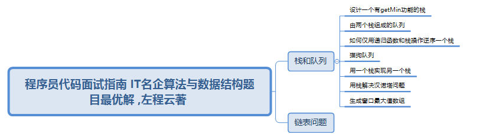

<!--
 * @Descripttion: 🐉内容简要概述
 * @Author: xinxin
 * @Date: 2020-02-22 10:16:12
 * @LastEditTime: 2021-06-02 11:08:06
 -->
## 目前更新进度
👉程序员代码面试指南 IT名企算法与数据结构题目最优解 ,左程云著

## 主要任务
👉学习左老师写的这本书，用javaScript再次实现该书的所列问题，不仅是为了自己加深理解，提高写作能力，更重要的是方便js爱好者的理解与参考。如果有不足之处，欢迎建议，感谢。
## 计划安排
👉建议来阅读一下这本书，无特殊情况，我会不定期更新，有事的话最晚每周更新一次  
👉[博客地址](https://blog.csdn.net/xinpxxin/category_9702664.html)
## 最后
- 👉有问题请提出，我会不断修正和优化，点个star,支持一下，祝各位大佬技术水平越来越高
